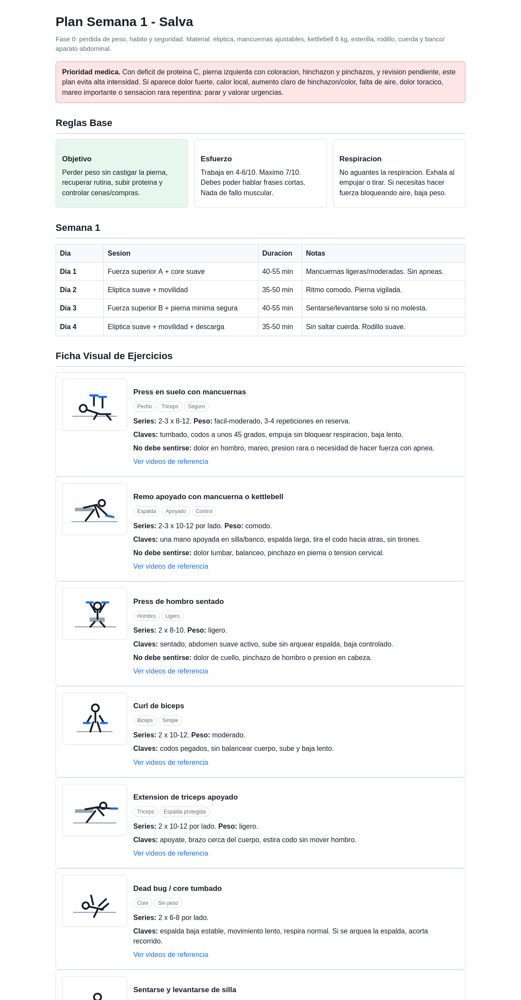
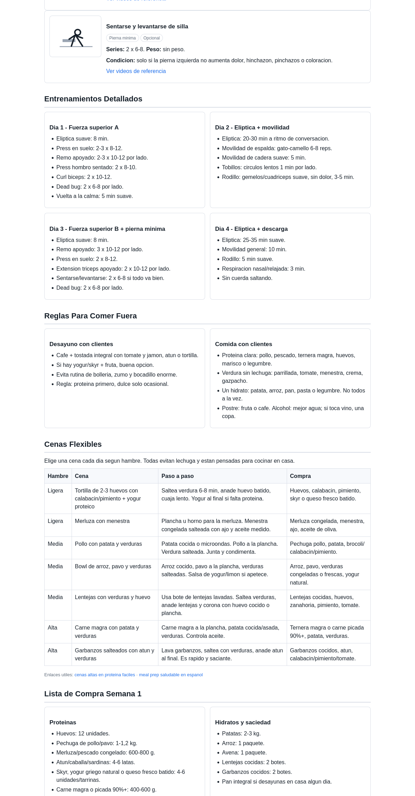
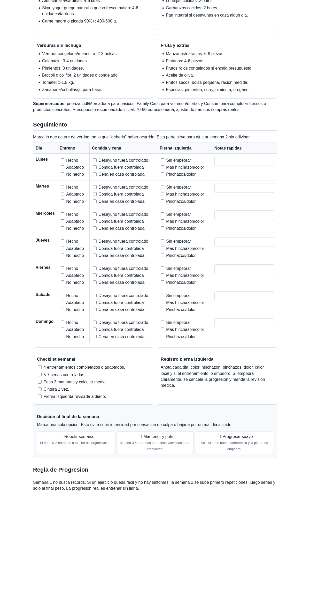

# Plan Semana 1 - Salva

Fase 0: pérdida de peso, hábito y seguridad.  
Material: elíptica, mancuernas ajustables, kettlebell 6 kg, esterilla, rodillo, cuerda y banco/aparato abdominal.

> Prioridad médica: con déficit de proteína C, pierna izquierda con coloración, hinchazón y pinchazos, y revisión pendiente, este plan evita alta intensidad. Si aparece dolor fuerte, calor local, aumento claro de hinchazón/color, falta de aire, dolor torácico, mareo importante o sensación rara repentina: parar y valorar urgencias.

## Ficha visual

## Checklist semanal

- [ ] 4 entrenamientos completados o adaptados.
- [ ] 5-7 cenas controladas.
- [ ] Peso 3 mañanas y calcular media.
- [ ] Cintura 1 vez.
- [ ] Pierna izquierda revisada a diario.

## Registro diario

| Día | Entreno | Comida y cena | Pierna izquierda | Notas rápidas |
|---|---|---|---|---|
| Lunes | [ ] Hecho [ ] Adaptado [ ] No hecho | [ ] Desayuno fuera controlado [ ] Comida fuera controlada [ ] Cena en casa controlada | [ ] Sin empeorar [ ] Más hinchazón/color [ ] Pinchazos/dolor |  |
| Martes | [ ] Hecho [ ] Adaptado [ ] No hecho | [ ] Desayuno fuera controlado [ ] Comida fuera controlada [ ] Cena en casa controlada | [ ] Sin empeorar [ ] Más hinchazón/color [ ] Pinchazos/dolor |  |
| Miércoles | [ ] Hecho [ ] Adaptado [ ] No hecho | [ ] Desayuno fuera controlado [ ] Comida fuera controlada [ ] Cena en casa controlada | [ ] Sin empeorar [ ] Más hinchazón/color [ ] Pinchazos/dolor |  |
| Jueves | [ ] Hecho [ ] Adaptado [ ] No hecho | [ ] Desayuno fuera controlado [ ] Comida fuera controlada [ ] Cena en casa controlada | [ ] Sin empeorar [ ] Más hinchazón/color [ ] Pinchazos/dolor |  |
| Viernes | [ ] Hecho [ ] Adaptado [ ] No hecho | [ ] Desayuno fuera controlado [ ] Comida fuera controlada [ ] Cena en casa controlada | [ ] Sin empeorar [ ] Más hinchazón/color [ ] Pinchazos/dolor |  |
| Sábado | [ ] Hecho [ ] Adaptado [ ] No hecho | [ ] Desayuno fuera controlado [ ] Comida fuera controlada [ ] Cena en casa controlada | [ ] Sin empeorar [ ] Más hinchazón/color [ ] Pinchazos/dolor |  |
| Domingo | [ ] Hecho [ ] Adaptado [ ] No hecho | [ ] Desayuno fuera controlado [ ] Comida fuera controlada [ ] Cena en casa controlada | [ ] Sin empeorar [ ] Más hinchazón/color [ ] Pinchazos/dolor |  |

## Decisión al final de la semana

Marca una sola opción:

- [ ] Repetir semana: si hubo 0-2 entrenos o mucha desorganización.
- [ ] Mantener y pulir: si hubo 3-4 entrenos pero cenas/comidas fuera irregulares.
- [ ] Progresar suave: solo si hubo buena adherencia y la pierna no empeoró.

## Semana 1

| Día | Sesión | Duración | Notas |
|---|---|---:|---|
| Día 1 | Fuerza superior A + core suave | 40-55 min | Mancuernas ligeras/moderadas. Sin apneas. |
| Día 2 | Elíptica suave + movilidad | 35-50 min | Ritmo cómodo. Pierna vigilada. |
| Día 3 | Fuerza superior B + pierna mínima segura | 40-55 min | Sentarse/levantarse solo si no molesta. |
| Día 4 | Elíptica suave + movilidad + descarga | 35-50 min | Sin saltar cuerda. Rodillo suave. |

## Enlaces rápidos de ejercicios

- [Press en suelo con mancuernas](https://www.youtube.com/results?search_query=press+suelo+mancuernas+tecnica)
- [Remo con mancuerna apoyado](https://www.youtube.com/results?search_query=remo+con+mancuerna+apoyado+tecnica)
- [Press de hombro sentado](https://www.youtube.com/results?search_query=press+hombro+sentado+mancuernas+tecnica)
- [Curl bíceps con mancuernas](https://www.youtube.com/results?search_query=curl+biceps+mancuernas+tecnica)
- [Extensión de tríceps apoyado](https://www.youtube.com/results?search_query=extension+triceps+mancuerna+apoyado+tecnica)
- [Dead bug](https://www.youtube.com/results?search_query=dead+bug+ejercicio+tecnica+espa%C3%B1ol)
- [Sentarse y levantarse de silla](https://www.youtube.com/results?search_query=sentarse+y+levantarse+de+silla+ejercicio+tecnica)

## Cenas flexibles

| Hambre | Cena | Paso a paso | Compra |
|---|---|---|---|
| Ligera | Tortilla de 2-3 huevos con calabacín/pimiento + yogur proteico | Saltea verdura 6-8 min, añade huevo batido, cuaja lento. Yogur al final si falta proteína. | Huevos, calabacín, pimiento, skyr o queso fresco batido. |
| Ligera | Merluza con menestra | Plancha u horno para la merluza. Menestra congelada salteada con ajo y aceite medido. | Merluza congelada, menestra, ajo, aceite de oliva. |
| Media | Pollo con patata y verduras | Patata cocida o microondas. Pollo a la plancha. Verdura salteada. Junta y condimenta. | Pechuga pollo, patata, brócoli/calabacín/pimiento. |
| Media | Bowl de arroz, pavo y verduras | Arroz cocido, pavo a la plancha, verduras salteadas. Salsa de yogur/limón si apetece. | Arroz, pavo, verduras congeladas o frescas, yogur natural. |
| Media | Lentejas con verduras y huevo | Usa bote de lentejas lavadas. Saltea verduras, añade lentejas y corona con huevo cocido o plancha. | Lentejas cocidas, huevos, zanahoria, pimiento, tomate. |
| Alta | Carne magra con patata y verduras | Carne magra a la plancha, patata cocida/asada, verduras. Controla aceite. | Ternera magra o carne picada 90%+, patata, verduras. |
| Alta | Garbanzos salteados con atún y verduras | Lava garbanzos, saltea con verduras, añade atún al final. Es rápido y saciante. | Garbanzos cocidos, atún, calabacín/pimiento/tomate. |

## Lista de compra base

### Proteínas

- Huevos: 12 unidades.
- Pechuga de pollo/pavo: 1-1,2 kg.
- Merluza/pescado congelado: 600-800 g.
- Atún/caballa/sardinas: 4-6 latas.
- Skyr, yogur griego natural o queso fresco batido: 4-6 unidades/tarrinas.
- Carne magra o picada 90%+: 400-600 g.

### Hidratos y saciedad

- Patatas: 2-3 kg.
- Arroz: 1 paquete.
- Avena: 1 paquete.
- Lentejas cocidas: 2 botes.
- Garbanzos cocidos: 2 botes.
- Pan integral si desayunas en casa algún día.

### Verduras sin lechuga

- Verdura congelada/menestra: 2-3 bolsas.
- Calabacín: 3-4 unidades.
- Pimientos: 3 unidades.
- Brócoli o coliflor: 2 unidades o congelado.
- Tomate: 1-1,5 kg.
- Zanahoria/cebolla/ajo para base.

### Fruta y extras

- Manzanas/naranjas: 6-8 piezas.
- Plátanos: 4-6 piezas.
- Frutos rojos congelados si encaja presupuesto.
- Aceite de oliva.
- Frutos secos, bolsa pequeña, ración medida.
- Especias: pimentón, curry, pimienta, orégano.

## Reglas para comer fuera

### Desayuno con clientes

- Café + tostada integral con tomate y jamón, atún o tortilla.
- Si hay yogur/skyr + fruta, buena opción.
- Evita rutina de bollería, zumo y bocadillo enorme.
- Regla: proteína primero, dulce solo ocasional.

### Comida con clientes

- Proteína clara: pollo, pescado, ternera magra, huevos, marisco o legumbre.
- Verdura sin lechuga: parrillada, tomate, menestra, crema, gazpacho.
- Un hidrato: patata, arroz, pan, pasta o legumbre. No todos a la vez.
- Postre: fruta o café. Alcohol: mejor agua; si toca vino, una copa.

